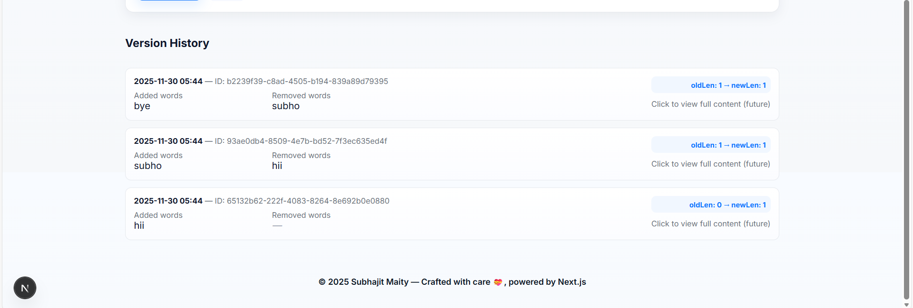

🌟 Mini Audit Trail Generator
Track changes. Understand edits. Keep history clean.

🎉 Overview

Mini Audit Trail Generator is a modern, minimal, and fast web application that captures and displays version history of text content.
It highlights the exact words added and removed, keeping your content changes transparent and easy to understand.

Built with Next.js, it combines frontend and backend logic in the same project using API routes. Designed with custom CSS, smooth animations, and a clean UI.

🏆 Live Demo
If deployed on Vercel, place your demo link here:
👉 https://your-vercel-url.vercel.app

🚀 Features

✨ Version Tracking
Every save creates a new version with timestamp + ID.

🔍 Word-Based Diff
Clearly shows:
Added words
Removed words
Old vs new content length

🎨 Modern UI
Animated header
Polished cards and shadows
Soft gradient backgrounds
Google fonts & clean spacing

⚡ Instant API
Uses lightweight serverless API routes:

/api/save-version  
/api/versions  

📦 Easy Deployment

Works out-of-the-box on Vercel.

🖼 Screenshots
🧩 Editor & Save Panel

  

📜 Version History

  

If you send me your real screenshots, I’ll insert them and crop them perfectly.

🛠 Tech Stack

  

Next.js – Fullstack framework

React – UI rendering

JavaScript (ES6+)

Vercel – Hosting & serverless APIs

Custom CSS for styling & animations

📁 Project Structure
mini-audit-trail/
│
├── pages/
│   ├── _app.js
│   ├── index.js
│   └── api/
│       ├── save-version.js
│       ├── versions.js
│       ├── clear-history.js (optional)
│       ├── diff.js
│       └── _storage.js
│
├── styles/
│   └── globals.css
│
├── public/
│   └── favicon.ico
│
├── package.json
└── README.md

🔧 Setup Instructions
1️⃣ Install dependencies
npm install
2️⃣ Run dev server
npm run dev
Visit:
👉 http://localhost:3000

3️⃣ Build for production
npm run build
npm start

🌐 Deploy on Vercel
Steps:

Push repository to GitHub

Go to https://vercel.com

Click New Project

Import your repo

Hit Deploy 🎉

Vercel automatically configures Next.js API routes.

🧠 How Diff Logic Works

The diff algorithm compares the old and new text in four steps:

Normalize text → lowercase, trim punctuation

Split into words

Count word occurrences (multiset)

Differences yield:

addedWords

removedWords

oldLength

newLength

Simple, fast, and predictable.

📌 Future Improvements

View full content modal

Export version history as PDF

Login & user accounts

Rich text editor

Database storage (MongoDB / Supabase)

👨‍💻 Author
👤 Subhajit Maity

📍 Durgapur, West Bengal
💼 Full Stack Developer 
✨ Passionate about clean UI & smart features.

